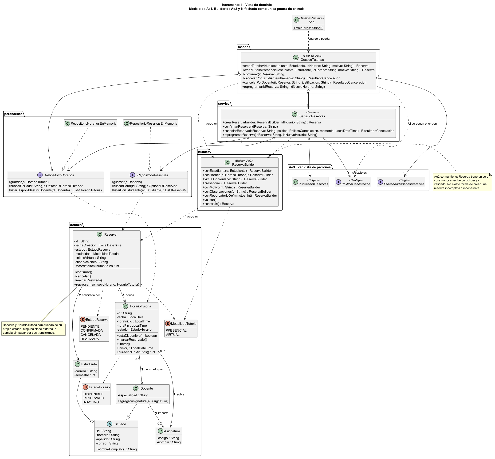
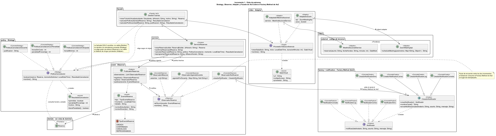
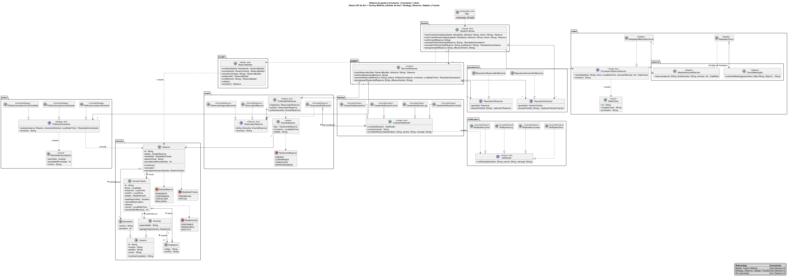
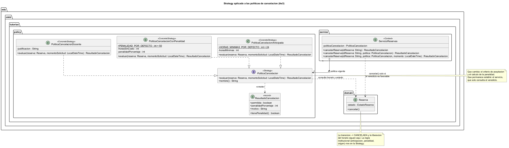
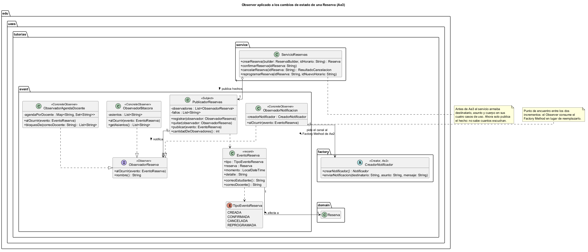
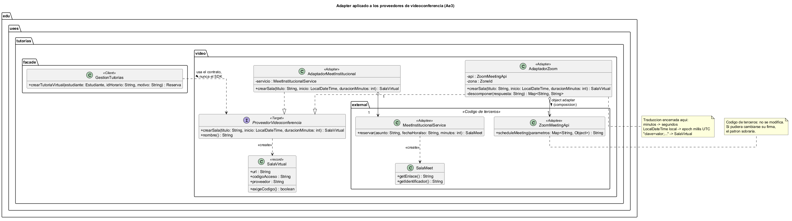
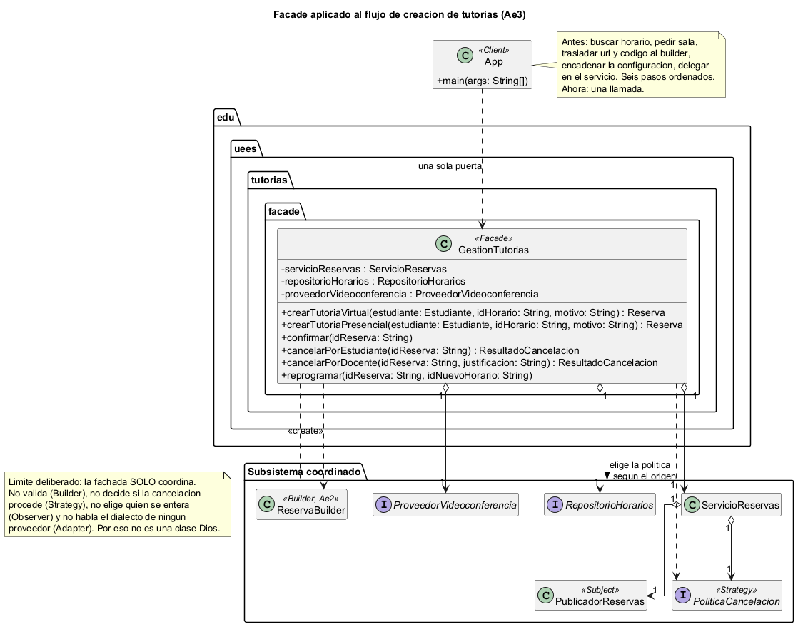

# Sistema de gestión de tutorías — Incremento 1

Universidad Espíritu Santo · Diseño de Software (UCOM0310) · **Ae3 — Incremento 1 del proyecto** · Semana 4, PEL 4 - 2026

Proyecto: **Justin Arreaga**
Repositorio: **https://github.com/justinjw93/Ae3_Patrones**

| Etapa | Entrega | Repositorio |
|---|---|---|
| Ae1 (Semana 2) | Análisis de dominio, diseño OO, cohesión/acoplamiento y SOLID | [diseno_software](https://github.com/justinjw93/diseno_software) |
| Ae2 (Semana 3) | Factory Method y Builder sobre ese diseño | [Ae2_Patrones](https://github.com/justinjw93/Ae2_Patrones) |
| **Ae3 (Semana 4)** | **Strategy, Observer, Adapter y Facade** | este repositorio |

## Propósito

Gestionar las tutorías académicas entre estudiantes y docentes: publicar horarios, reservarlos, confirmarlos, cancelarlos y reprogramarlos, manteniendo consistente la disponibilidad de cada bloque y avisando a quien corresponda.

El objetivo de diseño es que las **responsabilidades, dependencias y puntos de variación** del sistema sean explícitos y controlables: cada regla que cambia por razones distintas vive en un lugar distinto.

## Problema y alcance del incremento

El incremento parte de un proyecto que ya compilaba (20 pruebas verdes) y ataca **cuatro problemas reales** encontrados en ese código, no ejercicios de patrones.

| # | Problema observado en la línea base | Dónde | Patrón |
|---|---|---|---|
| 1 | La notificación estaba cableada en los cuatro casos de uso del servicio: agregar un receptor obligaba a editarlos todos | `service/ServicioReservas.java` | **Observer** |
| 2 | La regla de cancelación estaba congelada en el dominio: no admitía anticipación, penalidad ni origen de la solicitud | `domain/Reserva.java` | **Strategy** |
| 3 | El enlace de la tutoría virtual era un `String` escrito a mano; ningún proveedor reservaba la sala | `App.java` | **Adapter** |
| 4 | El cliente conocía y ordenaba seis colaboradores para crear una tutoría | `App.java` | **Facade** |

**Fuera de alcance:** persistencia real (los repositorios siguen en memoria), autenticación, y la integración de red con los proveedores de videoconferencia, que se simula con SDKs locales de firma incompatible.

El análisis completo, con la plantilla de justificación de cada patrón, está en **[`docs/incremento1.md`](docs/incremento1.md)**.

## Clases y componentes principales

| Componente | Rol |
|---|---|
| `GestionTutorias` | Fachada: única puerta de entrada a los casos de uso |
| `ServicioReservas` | Orquesta los casos de uso; Context de la Strategy |
| `Reserva`, `HorarioTutoria` | Dueñas de su propio estado y de sus transiciones |
| `ReservaBuilder` | Única puerta de construcción de una reserva, con validación en un solo punto |
| `PoliticaCancelacion` + 3 implementaciones | Reglas de cancelación intercambiables |
| `PublicadorReservas` + `ObservadorReserva` + 3 implementaciones | Publicación y consumo de los hechos de una reserva |
| `ProveedorVideoconferencia` + 2 adaptadores | Contrato propio de videoconferencia, aislado de cada SDK |
| `CreadorNotificador` / `Notificador` | Jerarquías Creator/Product del Factory Method |
| `RepositorioReservas`, `RepositorioHorarios` | Abstracciones de persistencia |

## Patrones utilizados y justificación

### Se mantienen de Ae2

| Patrón | Problema que resuelve | ¿Se mantiene? | Justificación |
|---|---|---|---|
| **Factory Method** | El cliente escribía `new NotificadorConsola()` y la configuración de cada canal se filtraba hacia él | **Sí** | El punto de variación sigue vivo y el patrón **ganó un consumidor**: `ObservadorNotificacion` no instancia canales, se los pide al `CreadorNotificador` |
| **Builder** | `Reserva` pasó de 4 a 9 datos: constructores telescópicos y ninguna validación única | **Sí** | La fachada construye a través del builder, así que la validación cruzada (VIRTUAL exige enlace) sigue ocurriendo en un solo lugar |

### Incorporados en Ae3

| Patrón | Problema real | Qué cambia | Qué permanece estable | Costo asumido |
|---|---|---|---|---|
| **Strategy** | La regla de cancelación estaba congelada dentro de `Reserva.cancelar()` | El criterio de aceptación y el cálculo de la penalidad | La transición `→ CANCELADA` y la liberación del horario, que siguen en `Reserva` | Tres clases más y una dependencia adicional en el servicio |
| **Observer** | El servicio decidía y redactaba la notificación en sus cuatro casos de uso | La lista de interesados y su reacción | Los casos de uso del servicio y el evento publicado | Indirección: leyendo `cancelarReserva` ya no se ve el correo saliendo |
| **Adapter** | La API del proveedor no coincide con el contrato (mapa de parámetros, epoch millis, duración en segundos) | El proveedor externo y su formato | `ProveedorVideoconferencia` y `SalaVirtual` | Una clase de traducción por proveedor; se pierden las funciones exclusivas del SDK |
| **Facade** | Crear una tutoría virtual exigía conocer y ordenar seis colaboradores | El orden y la cantidad de pasos internos | La operación `crearTutoriaVirtual(...)` | Riesgo de clase Dios, evitado: la fachada **solo coordina**, no decide reglas |

## Principios SOLID relevantes

| Principio | Dónde se aplica en este incremento |
|---|---|
| **SRP** | `Reserva` conserva su transición de estado; la política institucional vive en `policy/`. La fachada coordina, el servicio orquesta y el dominio protege sus reglas |
| **OCP** | Una política de cancelación nueva o un receptor de eventos nuevo son **clases nuevas**: ni `ServicioReservas` ni `Reserva` se modifican |
| **LSP** | Los tres ConcreteStrategy son intercambiables sin que el Context cambie; los dos adaptadores también. Las pruebas recorren listas del tipo abstracto sin mencionar clases concretas |
| **ISP** | `ProveedorVideoconferencia` expone solo lo que el sistema necesita —reservar una sala— y no el catálogo del SDK (grabaciones, encuestas, salas de espera) |
| **DIP** | El servicio depende de `PublicadorReservas`, `PoliticaCancelacion` y los repositorios; la fachada depende de `ProveedorVideoconferencia`, nunca de `ZoomMeetingApi` |

**Cohesión y acoplamiento.** El incremento **bajó** el acoplamiento del servicio: dejó de depender de `Notificador` (mensajería) y ganó una dependencia hacia una abstracción de publicación que no le impone receptores. Y subió la cohesión de `Reserva`, que volvió a ocuparse solo de su ciclo de vida.

## Diagramas UML

Generados con **PlantUML** (previsualizables y exportables con el plugin *PlantUML integration* de IntelliJ IDEA).

| Diagrama | Fuente |
|---|---|
|  | [`docs/uml-incremento1-dominio.puml`](docs/uml-incremento1-dominio.puml) — **general · vista de dominio** |
|  | [`docs/uml-incremento1-patrones.puml`](docs/uml-incremento1-patrones.puml) — **general · vista de patrones** |
|  | [`docs/uml-incremento1.puml`](docs/uml-incremento1.puml) — las dos vistas en un solo diagrama |
|  | [`docs/strategy-cancelacion.puml`](docs/strategy-cancelacion.puml) |
|  | [`docs/observer-reservas.puml`](docs/observer-reservas.puml) |
|  | [`docs/adapter-videoconferencia.puml`](docs/adapter-videoconferencia.puml) |
|  | [`docs/facade-tutorias.puml`](docs/facade-tutorias.puml) |
|  | [`docs/factory-method.puml`](docs/factory-method.puml) — Ae2 |
|  | [`docs/builder.puml`](docs/builder.puml) — Ae2 |
|  | [`docs/modelo-clases.puml`](docs/modelo-clases.puml) — modelo al **iniciar** el incremento |

## Requisitos

- JDK 21
- Apache Maven 3.9.x

## Compilación y ejecución

```bash
mvn clean compile
mvn clean test
mvn compile exec:java -Dexec.mainClass="edu.uees.tutorias.App"
```

Verificación de esta entrega:

```text
Tests run: 52, Failures: 0, Errors: 0, Skipped: 0
BUILD SUCCESS
```

`App` es el composition root y demuestra los seis patrones en orden: la fachada creando una tutoría virtual completa, los tres observadores reaccionando al mismo hecho, las tres políticas de cancelación sobre el mismo escenario, los dos proveedores de videoconferencia tras el mismo contrato y los canales del Factory Method.

## Estructura de paquetes

```text
semana4-patrones/
├── README.md
├── pom.xml
├── docs/
│   ├── analisis.md                    # análisis de dominio y SOLID (Ae1)
│   ├── patrones.md                    # Factory Method y Builder (Ae2)
│   ├── incremento1.md                 # informe del incremento (Ae3)
│   ├── uml-incremento1-dominio.puml / .png    # general · vista de dominio
│   ├── uml-incremento1-patrones.puml / .png   # general · vista de patrones
│   ├── uml-incremento1.puml / .png            # ambas vistas consolidadas
│   ├── strategy-cancelacion.puml / .png
│   ├── observer-reservas.puml / .png
│   ├── adapter-videoconferencia.puml / .png
│   ├── facade-tutorias.puml / .png
│   ├── factory-method.puml / .png
│   ├── builder.puml / .png
│   └── modelo-clases.puml / .png      # estado inicial del incremento
└── src/
    ├── main/java/edu/uees/tutorias/
    │   ├── App.java                   # composition root
    │   ├── facade/                    # GestionTutorias                (Facade, Ae3)
    │   ├── service/                   # ServicioReservas               (Context)
    │   ├── policy/                    # PoliticaCancelacion + 3        (Strategy, Ae3)
    │   ├── event/                     # Publicador, Observador + 3     (Observer, Ae3)
    │   ├── video/                     # ProveedorVideoconferencia + 2  (Adapter, Ae3)
    │   │   └── external/              # SDKs simulados de terceros     (Adaptees)
    │   ├── builder/                   # ReservaBuilder                 (Builder, Ae2)
    │   ├── factory/                   # CreadorNotificador + 4         (Factory Method, Ae2)
    │   ├── notification/              # Notificador + 4                (Products, Ae2)
    │   ├── domain/                    # Reserva, HorarioTutoria, ...   (Ae1)
    │   └── persistence/               # repositorios                   (Ae1)
    └── test/java/edu/uees/tutorias/
        └── facade/ event/ policy/ video/ builder/ factory/ service/
```

## Continuidad con Ae1 y Ae2

El diseño de Ae1 ([`docs/analisis.md`](docs/analisis.md)) sigue vigente y es el que hizo baratos estos cuatro cambios: el Observer encontró su lugar porque el servicio ya recibía sus colaboraciones por interfaz, el Strategy porque `Reserva` ya protegía su propio estado, y el Adapter porque la inversión de dependencias ya era la norma del proyecto. Ninguno de los cuatro patrones obligó a modificar los repositorios ni las reglas de transición de estado.

## Declaración de uso de inteligencia artificial

Para esta actividad utilicé herramientas de inteligencia artificial. Me apoyé en el modelo Claude para agilizar el análisis de los problemas de diseño, la generación preliminar del código en Java, el diseño de los diagramas UML y la documentación técnica. Revisé, probé y adapté el contenido generado: todo el código fue inspeccionado y verificado mediante compilación y ejecución de pruebas con Maven y JDK 21, y puedo explicar y justificar el código y las decisiones de diseño presentadas.
