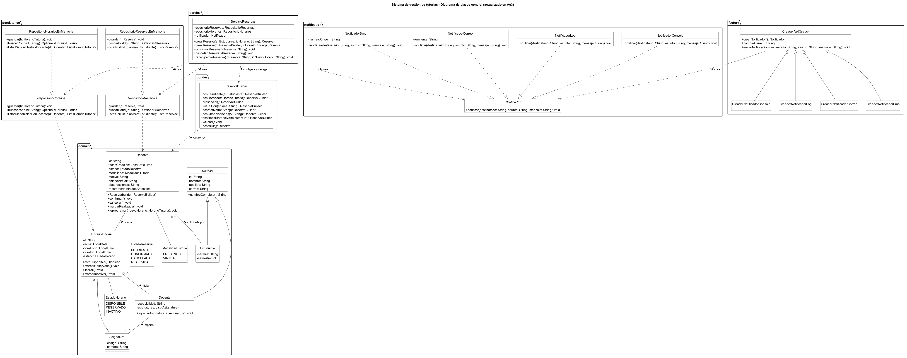

# Implementación comparativa de patrones de diseño

Universidad Espíritu Santo · Diseño de Software (UCOM0310) · Ae3 — Implementación comparativa de patrones de diseño · Semana 4, PEL 4 - 2026

Proyecto: **Justin Arreaga**  
Repositorio: **https://github.com/justinjw93/Ae3_Patrones**

## Propósito

Implementar y comparar **Factory Method** y **Builder** sobre problemas concretos del Sistema de gestión de tutorías, justificando qué problema resuelve cada patrón, cómo se representa en UML y cómo se traduce a Java.

Este repositorio parte del modelo orientado a objetos entregado en Ae1 (Semana 2) y conserva su historial: los patrones se aplican **sobre** ese diseño, no lo reemplazan.

## Problemas que resuelve cada patrón

| Patrón | Problema del código anterior | Solución |
|---|---|---|
| **Factory Method** | `App` elegía el canal escribiendo `new NotificadorConsola()`: el cliente quedaba amarrado a una clase concreta y la configuración propia de cada canal (remitente, número de origen, límite de caracteres) se filtraba hacia él. | Jerarquía `CreadorNotificador` → cada ConcreteCreator decide qué `Notificador` construir y con qué configuración. |
| **Builder** | Al registrar modalidad, motivo, enlace, observaciones y recordatorio, `Reserva` pasó de 4 a 9 datos: constructores telescópicos, tres `String` consecutivos intercambiables sin error de compilación, `null` obligatorios y ningún punto único de validación. | `ReservaBuilder` con Fluent API, valores por defecto y `validar()` como única puerta de construcción. |

Desarrollo completo, con código, UML y tabla comparativa, en **[`docs/patrones.md`](docs/patrones.md)**.

## Parte A · Factory Method

| Rol GoF | Clases |
|---|---|
| Product | `Notificador` |
| ConcreteProduct | `NotificadorConsola`, `NotificadorLog`, `NotificadorCorreo`, `NotificadorSms` |
| Creator | `CreadorNotificador` (abstracta) |
| ConcreteCreator | `CreadorNotificadorConsola`, `CreadorNotificadorLog`, `CreadorNotificadorCorreo`, `CreadorNotificadorSms` |
| Client | `App` |

El Creator declara la operación de fábrica `crearNotificador()` y define sobre ella la operación estable `enviarNotificacion(...)`, que identifica el canal y delega el envío al producto.

**Evidencia de extensibilidad:** el canal SMS se agregó después de tener el patrón funcionando y su commit (`feat: agregar nueva variante de notificacion`) contiene únicamente archivos nuevos. No cambió el contrato, ni el Creator, ni los creadores previos, ni `ServicioReservas`.

## Parte B · Builder

- **Obligatorios:** `estudiante`, `horario`.
- **Con valor por defecto:** `id` (UUID), `fechaCreacion` (`now()`), `modalidad` (`PRESENCIAL`), `motivo` (`"Tutoria general"`), `recordatorioMinutosAntes` (`60`).
- **Opcionales sin defecto:** `enlaceVirtual`, `observaciones`.

```java
Reserva reserva = new ReservaBuilder()
        .conEstudiante(estudiante)
        .conHorario(horario)
        .virtualCon("https://meet.uees.edu.ec/tutoria-h003")
        .conMotivo("Consulta sobre normalizacion")
        .conRecordatorioDe(30)
        .construir();
```

`Reserva` quedó con un solo constructor, que recibe el builder y vuelve a invocar `validar()` antes de copiar los datos: no existe forma de crear una reserva incompleta o incoherente. El horario se ocupa después de validar, de modo que una construcción rechazada no deja el bloque bloqueado.

## Diagramas UML

| Diagrama | Fuente |
|---|---|
|  | [`docs/factory-method.puml`](docs/factory-method.puml) |
|  | [`docs/builder.puml`](docs/builder.puml) |
|  | [`docs/modelo-clases.puml`](docs/modelo-clases.puml) |

## Requisitos

- JDK 21
- Apache Maven 3.9.x

## Compilación y ejecución

```bash
mvn clean compile
mvn clean test
mvn compile exec:java -Dexec.mainClass="edu.uees.tutorias.App"
```

`App` ejecuta el flujo de reserva heredado de Ae1 y, a continuación, las dos demostraciones de la actividad: el mismo aviso enviado por cada canal a través de sus ConcreteCreators, y las dos configuraciones de `Reserva` construidas con el builder.

## Estructura del proyecto

```text
semana4-patrones/
├── README.md
├── pom.xml
├── docs/
│   ├── analisis.md            # análisis de dominio, cohesión/acoplamiento y SOLID (Ae1)
│   ├── patrones.md            # problemas, solución y comparación de patrones (Ae3)
│   ├── factory-method.puml / .png
│   ├── builder.puml / .png
│   └── modelo-clases.puml / .png
└── src/
    ├── main/java/edu/uees/tutorias/
    │   ├── App.java
    │   ├── builder/           # ReservaBuilder
    │   ├── factory/           # CreadorNotificador y ConcreteCreators
    │   ├── domain/
    │   ├── service/
    │   ├── persistence/
    │   └── notification/      # Notificador y ConcreteProducts
    └── test/java/edu/uees/tutorias/
        ├── builder/
        ├── factory/
        └── service/
```

## Continuidad con Ae1

El diseño de la semana anterior (clases, responsabilidades, cohesión/acoplamiento y principios SOLID) está documentado en [`docs/analisis.md`](docs/analisis.md) y sigue vigente. Los patrones se apoyaron en él: el Factory Method encontró su lugar porque `Notificador` ya era una interfaz, y el Builder porque `Reserva` ya protegía su propio estado. Ninguno obligó a modificar `ServicioReservas`, los repositorios ni las reglas de transición de estado.

## Declaración de uso de inteligencia artificial

Para esta actividad utilicé herramientas de inteligencia artificial. Me apoyé en el modelo Claude para agilizar la organización del caso, la generación preliminar del código en Java, el diseño de los diagramas UML y la documentación técnica. Revisé, probé y adapté el contenido generado: todo el código fue inspeccionado y verificado mediante compilación y ejecución de pruebas con Maven y JDK 21, y puedo explicar y justificar el código y las decisiones de diseño presentadas.
