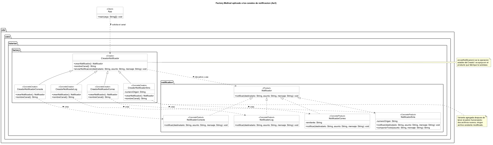
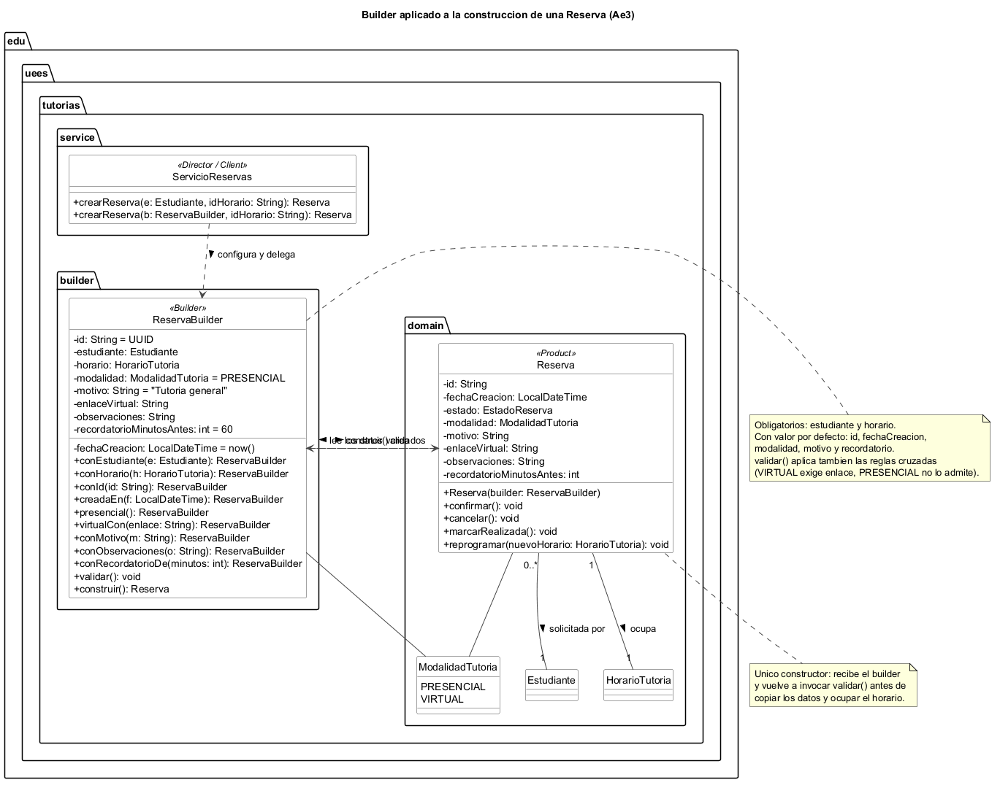

# Implementación comparativa de patrones de diseño

Factory Method y Builder aplicados al Sistema de gestión de tutorías — Ae3 (UCOM0310, Semana 3)

**Autor:** Justin Arreaga  
**Repositorio:** https://github.com/justinjw93/Ae3_Patrones

Este documento continúa el modelo orientado a objetos entregado en Ae1 ([`docs/analisis.md`](analisis.md)). El sistema no se rehízo: los dos patrones se introdujeron sobre el diseño existente, resolviendo problemas que ese mismo diseño dejó abiertos.

## Parte A · Factory Method

### Problema inicial

En Ae1 el canal de notificación se elegía escribiendo la clase concreta en el *composition root*:

```java
Notificador notificador = new NotificadorConsola();   // App.java, Ae1
```

Esa línea funciona mientras exista un solo canal. Al aparecer el correo institucional, el registro de auditoría y el SMS, se hicieron visibles tres problemas:

1. **El cliente queda amarrado a clases concretas.** Cambiar de canal obliga a editar el código del cliente, no a configurarlo.
2. **La configuración del canal se filtra al cliente.** El correo necesita un remitente institucional; el SMS, un número de origen y un recorte a 160 caracteres. Con `new` directo, quien quiere notificar debe conocer esos detalles.
3. **No hay un lugar donde poner lo que todos los canales comparten.** Por ejemplo, la exigencia de que todo mensaje del sistema quede identificado con el canal por el que salió.

La creación de un notificador dejó de ser un `new` trivial: se convirtió en una decisión con reglas propias, y ese es exactamente el terreno del Factory Method.

### Solución implementada

| Rol GoF | Clase | Paquete |
|---|---|---|
| Product | `Notificador` | `notification` |
| ConcreteProduct | `NotificadorConsola`, `NotificadorLog`, `NotificadorCorreo`, `NotificadorSms` | `notification` |
| Creator | `CreadorNotificador` (abstracta) | `factory` |
| ConcreteCreator | `CreadorNotificadorConsola`, `CreadorNotificadorLog`, `CreadorNotificadorCorreo`, `CreadorNotificadorSms` | `factory` |
| Client | `App`, `ServicioReservas` | raíz, `service` |

`CreadorNotificador` declara la operación de fábrica `crearNotificador()` y, apoyándose en ella, define la operación estable `enviarNotificacion(...)`, que antepone el nombre del canal al mensaje y delega el envío al producto. El Creator no sabe qué clase concreta se instanciará: lo decide cada subclase.

```java
public abstract class CreadorNotificador {
    public abstract Notificador crearNotificador();
    public abstract String nombreCanal();

    public void enviarNotificacion(String destinatario, String asunto, String mensaje) {
        Notificador notificador = crearNotificador();
        notificador.notificar(destinatario, asunto, "[" + nombreCanal() + "] " + mensaje);
    }
}
```

El cliente trabaja únicamente contra el tipo abstracto. En `App` el bucle de demostración recorre los creadores sin nombrar una sola clase concreta de notificador:

```java
List<CreadorNotificador> creadores = List.of(
        new CreadorNotificadorConsola(),
        new CreadorNotificadorLog(),
        new CreadorNotificadorCorreo());

for (CreadorNotificador creador : creadores) {
    creador.enviarNotificacion(destinatario, "Recordatorio de tutoria",
            "Recuerda tu tutoria programada.");
}
```

### Variante adicional y extensibilidad

El canal SMS se agregó **después** de tener el patrón funcionando, en el commit `feat: agregar nueva variante de notificacion`. El diff de ese commit contiene exactamente tres archivos y los tres son nuevos:

```
A  src/main/java/edu/uees/tutorias/notification/NotificadorSms.java
A  src/main/java/edu/uees/tutorias/factory/CreadorNotificadorSms.java
A  src/test/java/edu/uees/tutorias/factory/CreadorNotificadorSmsTest.java
```

`NotificadorSms` trae una restricción que ningún otro canal comparte —recortar el texto a 160 caracteres— y `CreadorNotificadorSms` encapsula el número de origen institucional. Ninguno de los dos detalles llega al cliente.

### Qué clases cambian y cuáles permanecen estables

| | Clases |
|---|---|
| **Cambian al agregar un canal** | Ninguna. Solo se añaden un ConcreteProduct y un ConcreteCreator. |
| **Permanecen estables** | `Notificador` (el contrato), `CreadorNotificador` (incluida su operación `enviarNotificacion`), los ConcreteCreators anteriores, `ServicioReservas`, los repositorios y todo el dominio. |
| **Cambia al elegir otro canal por defecto** | Una línea de `App`, el *composition root*: `new CreadorNotificadorCorreo()` por el creador deseado. |

El punto de variación quedó aislado en un solo lugar, y ese lugar es el único que el sistema necesita tocar para cambiar de canal.

### UML



Fuente editable: [`factory-method.puml`](factory-method.puml).

## Parte B · Builder

### Problema inicial

La `Reserva` de Ae1 se construía con cuatro datos:

```java
new Reserva(id, estudiante, horario, fechaCreacion);   // Ae1
```

Al registrar lo que la coordinación académica necesita —modalidad, motivo, enlace de conexión, observaciones y anticipación del recordatorio— la clase pasó a nueve datos entre obligatorios y opcionales. Resolverlo con constructores produjo tres sobrecargas telescópicas encadenadas y una llamada como esta (commit `feat: ampliar reserva con datos opcionales de tutoria`):

```java
new Reserva("R002", estudiante, horarioVirtual, LocalDateTime.now(),
        ModalidadTutoria.VIRTUAL, "Consulta sobre normalizacion",
        "https://meet.uees.edu.ec/tutoria-h002", "El estudiante enviara su avance", 30);
```

Los problemas concretos de esa llamada:

1. **Ilegible en el punto de uso.** Ningún argumento dice qué significa; hay que abrir la clase para saber si el `30` son minutos u horas.
2. **Errores silenciosos.** `motivo`, `enlaceVirtual` y `observaciones` son tres `String` consecutivos: intercambiarlos compila sin una sola advertencia.
3. **`null` obligatorios.** Una tutoría presencial debe pasar `null` en el enlace, y ese `null` no distingue "no aplica" de "se me olvidó".
4. **Sin punto único de validación.** La regla "toda tutoría virtual necesita enlace" no tenía dónde vivir; cada constructor habría tenido que repetirla.
5. **Crece mal.** Cada campo opcional nuevo agrega otra sobrecarga y multiplica las combinaciones.

### Campos obligatorios y opcionales

| Campo | Tipo | Clasificación | Valor por defecto |
|---|---|---|---|
| `estudiante` | `Estudiante` | **Obligatorio** | — |
| `horario` | `HorarioTutoria` | **Obligatorio** | — |
| `id` | `String` | Opcional | `UUID` aleatorio |
| `fechaCreacion` | `LocalDateTime` | Opcional | `LocalDateTime.now()` |
| `modalidad` | `ModalidadTutoria` | Opcional | `PRESENCIAL` |
| `motivo` | `String` | Opcional | `"Tutoria general"` |
| `recordatorioMinutosAntes` | `int` | Opcional | `60` |
| `enlaceVirtual` | `String` | Opcional | sin valor (obligatorio si la modalidad es `VIRTUAL`) |
| `observaciones` | `String` | Opcional | sin valor |

### Solución implementada

`ReservaBuilder` (paquete `builder`) reúne los datos con una Fluent API en la que cada método nombra lo que recibe y devuelve `this`:

```java
Reserva reserva = new ReservaBuilder()
        .conEstudiante(estudiante)
        .conHorario(horario)
        .virtualCon("https://meet.uees.edu.ec/tutoria-h003")
        .conMotivo("Consulta sobre normalizacion")
        .conObservaciones("El estudiante enviara su avance antes de la sesion")
        .conRecordatorioDe(30)
        .construir();
```

Tres decisiones concretas de esta implementación:

- **`virtualCon(enlace)` exige el enlace en la misma llamada.** Es imposible declarar una tutoría virtual y olvidar por dónde se conecta el estudiante; y `presencial()` limpia el enlace heredado, para que no queden combinaciones incoherentes a medio configurar.
- **`validar()` es el único punto donde viven las reglas de construcción**: obligatorios presentes, `VIRTUAL` con enlace, `PRESENCIAL` sin enlace y recordatorio entre 0 y 1440 minutos.
- **`Reserva` conserva un solo constructor y recibe el builder**, no los nueve datos sueltos. Ese constructor vuelve a invocar `validar()` antes de copiar nada, de modo que ninguna reserva pueda existir sin haber pasado la validación aunque alguien instancie el builder por fuera de `construir()`.

Además, el horario se ocupa **después** de validar: una construcción rechazada no deja el bloque de tutoría bloqueado. En Ae1 el `marcarReservado()` estaba en el constructor, antes de cualquier verificación de los datos opcionales.

### Las dos configuraciones

| | Configuración mínima | Configuración completa |
|---|---|---|
| Llamada | `conEstudiante(...).conHorario(...)` | `conEstudiante(...).virtualCon(...).conMotivo(...).conObservaciones(...).conRecordatorioDe(30)` |
| Modalidad | `PRESENCIAL` (defecto) | `VIRTUAL` |
| Motivo | `"Tutoria general"` (defecto) | `"Consulta sobre normalizacion"` |
| Enlace | no aplica | `https://meet.uees.edu.ec/tutoria-h003` |
| Recordatorio | `60` min (defecto) | `30` min |

Ambas se ejecutan en `App` y se verifican en `ReservaBuilderTest`.

### Efecto sobre el servicio

`ServicioReservas` ganó una sobrecarga que acepta un builder ya configurado y solo completa el horario, que es el dato que depende del repositorio:

```java
public Reserva crearReserva(ReservaBuilder builder, String idHorario) {
    HorarioTutoria horario = obtenerHorario(idHorario);
    Reserva reserva = builder.conHorario(horario).construir();
    ...
}
```

Así el servicio **no crece un parámetro cada vez que la reserva gana un campo opcional**, que era el otro efecto colateral del constructor telescópico.

### UML



Fuente editable: [`builder.puml`](builder.puml).

## Parte C · Comparación técnica

| Criterio | Factory Method | Builder |
|---|---|---|
| **Problema que resuelve** | El cliente necesita un objeto pero no debe decidir ni conocer **qué clase concreta** se instancia. | Un objeto tiene **demasiados datos** entre obligatorios y opcionales para construirse en una sola llamada legible y validada. |
| **Variabilidad principal** | Varía el **tipo** del objeto creado (consola, log, correo, SMS). El proceso de creación es trivial. | Varía la **configuración** de un objeto de un solo tipo (`Reserva`). El proceso de creación es lo complejo. |
| **Participantes** | Product (`Notificador`), ConcreteProduct (`NotificadorCorreo`…), Creator (`CreadorNotificador`), ConcreteCreator (`CreadorNotificadorCorreo`…), Client (`App`). | Builder (`ReservaBuilder`), Product (`Reserva`), Client/Director (`ServicioReservas`, `App`). |
| **Ventaja principal** | Extensibilidad: agregar una variante son archivos nuevos, sin modificar los existentes (OCP verificable en el diff). | Legibilidad y seguridad: cada dato se nombra en el punto de uso y existe un único lugar donde validar antes de construir. |
| **Costo / consecuencia** | Dos clases nuevas por cada variante y una jerarquía paralela Product/Creator que hay que mantener alineada. | Una clase adicional que duplica los campos del producto; el objeto queda temporalmente incompleto dentro del builder, y el builder es mutable. |
| **Cuándo utilizarlo** | Cuando el tipo concreto depende de configuración, contexto o entorno, y se prevé que aparezcan variantes nuevas. | Cuando el constructor supera unos cuatro parámetros, hay opcionales con valores por defecto, o existen reglas que relacionan varios campos entre sí. |
| **Cuándo evitarlo** | Con una sola implementación estable, o cuando la inyección de dependencias por constructor ya resuelve la elección: el patrón agregaría una jerarquía sin variación real que la justifique. | Con pocos campos y todos obligatorios: un constructor directo (o un `record`) es más claro, y el builder sería ceremonia sin beneficio. |

### Lectura de la comparación

Los dos patrones son **creacionales**, pero atacan preguntas distintas: Factory Method responde *"¿qué objeto creo?"*; Builder responde *"¿cómo armo este objeto?"*. Por eso conviven sin solaparse en el mismo sistema: `CreadorNotificadorCorreo` decide una **clase**, `ReservaBuilder` decide una **configuración**.

La diferencia se nota en dónde se paga el costo. En Factory Method el costo es estructural y crece con cada variante (dos clases más cada vez), a cambio de que el código existente nunca se toque. En Builder el costo se paga una sola vez —una clase que duplica los campos del producto— y no vuelve a crecer: agregar un campo opcional es un método más, no una combinación más.

También se diferencian en el momento en que protegen al sistema. Factory Method protege **en tiempo de compilación**: el cliente no puede depender de una clase concreta porque no la nombra. Builder protege **en tiempo de construcción**: la validación de `validar()` ocurre antes de que exista el objeto, de modo que una `Reserva` mal formada nunca llegue a instanciarse.

## Conclusiones

Aplicar los dos patrones sobre el modelo de Ae1 dejó tres aprendizajes concretos.

**Primero, el patrón debe responder a un problema que ya se manifestó.** Los dos casos partieron de una molestia real y verificable en el código anterior: un `new NotificadorConsola()` que amarraba al cliente a una clase concreta, y un constructor que pasó de cuatro a nueve parámetros. El historial de commits lo conserva a propósito: el commit `feat: ampliar reserva con datos opcionales de tutoria` introduce el constructor telescópico y el siguiente lo resuelve. El problema es parte de la evidencia, no algo que convenga esconder.

**Segundo, la extensibilidad se demuestra con el diff, no con el discurso.** Agregar el canal SMS después de tener el patrón terminado produjo un commit compuesto únicamente por archivos nuevos. Eso es lo que significa "abierto a extensión y cerrado a modificación", y es comprobable por cualquiera que revise el repositorio.

**Tercero, los patrones se apoyan en el diseño previo en lugar de reemplazarlo.** Ninguno de los dos obligó a tocar `ServicioReservas` en su lógica, ni los repositorios, ni las reglas de estado de `Reserva` y `HorarioTutoria`. El Factory Method encontró su lugar porque en Ae1 ya existía la interfaz `Notificador`; el Builder encontró el suyo porque `Reserva` ya protegía su propio estado. La inversión de dependencias hecha en la semana anterior fue la que hizo baratos estos cambios, y esa continuidad —más que las clases nuevas— es el resultado que vale la pena señalar.
